# Triply - dokumentacja projektu

Triply to frontendowa aplikacja SPA do planowania podróży i odkrywania atrakcji turystycznych. Projekt został przygotowany tak, aby możliwie wiernie odwzorować design z Figmy oraz spełnić wymagania dotyczące routingu, komponentyzacji, autentykacji Firebase, analityki i deploymentu.

Wersja produkcyjna aplikacji jest dostępna pod adresem:

[https://triply-henna.vercel.app/](https://triply-henna.vercel.app/)

Dane testowego użytkownika:

- email: `testbot2@email.com`
- hasło: `Testbot2!`

## Struktura projektu

Repozytorium ma strukturę dopasowaną do aplikacji React z wydzielonymi stronami, feature modules oraz reużywalnym design systemem.

```txt
src/
  auth/                 # AuthContext i AuthProvider dla Firebase Authentication
  components/           # Komponenty wspólne i design system
    design-system/      # Button, Input, Dialog, Tabs, Navbar, cards, typography
    shared/             # Wspólne komponenty domenowe, np. PlaceCard i PlaceDetails
  context/              # Globalne contexty, np. wygenerowany plan i toast
  features/             # Logika i komponenty podzielone według funkcjonalności
    explore/
    home/
    profile/
    schedule/
  lib/                  # Konfiguracje integracji, np. Firebase
  mock/                 # Dane mockowe miejsc i planów
  pages/                # Osobne komponenty stron używane przez React Router
  types/                # współdzielone typy TypeScript
  utils/                # Funkcje pomocnicze, np. generator planu
```

## Routing i podział na strony

Routing został zaimplementowany w `src/App.tsx` z użyciem `BrowserRouter`, `Routes` i `Route` z React Router. Każdy główny ekran z designu jest dostępny pod osobnym URL.

```tsx
<BrowserRouter>
  <ScrollToTop />
  <ToastProvider>
    <GeneratedPlanProvider>
      <Routes>
        <Route element={<MainLayout />}>
          <Route path="/" element={<HomePage />} />
          <Route path="/explore" element={<ExplorePage />} />
          <Route path="/login" element={<LoginPage />} />
          <Route path="/register" element={<RegisterPage />} />
          <Route path="/privacy-policy" element={<PrivacyPolicyPage />} />
          <Route
            path="/terms-and-conditions"
            element={<TermsAndConditionsPage />}
          />

          <Route element={<ProtectedRoute />}>
            <Route path="/schedule" element={<SchedulePlaceholderPage />} />
            <Route path="/schedule/:id" element={<SchedulePage />} />
            <Route path="/profile" element={<ProfilePage />} />
          </Route>
        </Route>
      </Routes>
    </GeneratedPlanProvider>
  </ToastProvider>
</BrowserRouter>
```

Trasy publiczne:

- `/` - kreator planu podróży.
- `/explore` - eksploracja miejsc.
- `/login` - logowanie.
- `/register` - rejestracja.
- `/privacy-policy` - polityka prywatności.
- `/terms-and-conditions` - regulamin.

Trasy chronione:

- `/schedule` - ekran startowy harmonogramu.
- `/schedule/:id` - widok wygenerowanego lub zapisanego planu.
- `/profile` - profil użytkownika.

## Ochrona tras dla zalogowanych użytkowników

Dostęp do profilu i harmonogramu jest zabezpieczony przez komponent `ProtectedRoute`. Komponent sprawdza aktualny stan użytkownika z `AuthContext`. Jeśli użytkownik nie jest zalogowany, React Router wykonuje redirect na `/login`. Jeśli użytkownik jest zalogowany, renderowany jest `Outlet`, czyli właściwa strona wewnątrz chronionej grupy tras.

```tsx
export default function ProtectedRoute() {
  const { user, loading } = useAuth();

  if (loading) {
    return null;
  }

  if (!user) {
    return <Navigate to="/login" replace />;
  }

  return <Outlet />;
}
```

Dodatkowo `App` obsługuje globalny stan ładowania autentykacji. Dopóki Firebase nie zwróci informacji o sesji użytkownika, aplikacja pokazuje loader zamiast przedwcześnie renderować chronione widoki.

## Autentykacja Firebase

Autentykacja jest zrealizowana przy użyciu Firebase Authentication. Konfiguracja Firebase znajduje się w `src/lib/firebase.ts` i korzysta ze zmiennych środowiskowych w formacie `VITE_FIREBASE_*`.

```ts
const firebaseConfig = {
  apiKey: import.meta.env.VITE_FIREBASE_API_KEY,
  authDomain: import.meta.env.VITE_FIREBASE_AUTH_DOMAIN,
  projectId: import.meta.env.VITE_FIREBASE_PROJECT_ID,
  storageBucket: import.meta.env.VITE_FIREBASE_STORAGE_BUCKET,
  messagingSenderId: import.meta.env.VITE_FIREBASE_MESSAGING_SENDER_ID,
  appId: import.meta.env.VITE_FIREBASE_APP_ID,
  measurementId: import.meta.env.VITE_FIREBASE_MEASUREMENT_ID,
};

const app = initializeApp(firebaseConfig);
export const auth = getAuth(app);
```

Stan logowania jest udostępniany globalnie przez `AuthProvider`. Provider używa `onAuthStateChanged`, więc aplikacja reaguje na logowanie, wylogowanie oraz odświeżenie strony bez ręcznego synchronizowania sesji.

```tsx
useEffect(() => {
  const unsubscribe = onAuthStateChanged(auth, (currentUser) => {
    setUser(currentUser);
    setLoading(false);
  });

  return () => unsubscribe();
}, []);
```

Obsługiwane są następujące flow:

- logowanie przez email i hasło przy użyciu `signInWithEmailAndPassword`,
- rejestracja przez email i hasło przy użyciu `createUserWithEmailAndPassword`,
- logowanie i rejestracja przez Google przy użyciu `GoogleAuthProvider` i `signInWithPopup`,
- wylogowanie przez `signOut`, dostępne w navbarze dla zalogowanych użytkowników.

## Funkcjonalności według stron

### Strona główna - `/`

Strona główna jest głównym kreatorem planu podróży. Widok łączy formularz filtrów z sekcją podpowiedzi miejsc. Formularz pozwala dobrać parametry planu, a sugestie umożliwiają przypięcie konkretnych miejsc, które mają zostać uwzględnione podczas generowania.

Najważniejsze elementy strony:

- wybór miasta,
- liczba dni,
- data startu,
- typy miejsc,
- minimalna ocena,
- przedział cenowy,
- poziom zatłoczenia,
- grupa docelowa,
- styl podróży,
- zainteresowania,
- preferencje gastronomiczne,
- podpowiedzi atrakcji,
- przypinanie miejsc do planu,
- generowanie planu,
- zapis preferencji.

Logika formularza jest wydzielona do hooka `usePlanFilters`, a sam formularz do komponentu `FilterCard`. Dzięki temu strona `HomePage` pozostaje czytelna i odpowiada głównie za kompozycję widoku.

Przykład wywołania generowania planu z filtrami i przypiętymi miejscami:

```tsx
const generation = usePlanGeneration({
  generatePlan,
  getPlanFilters: () => ({
    ...filters.getPlanFilters(),
    pinnedPlaceIds,
  }),
});
```

Jeżeli użytkownik nie jest zalogowany i kliknie generowanie, aplikacja przekierowuje go na `/login`. Zalogowany użytkownik przechodzi po wygenerowaniu planu na `/schedule/generated`.

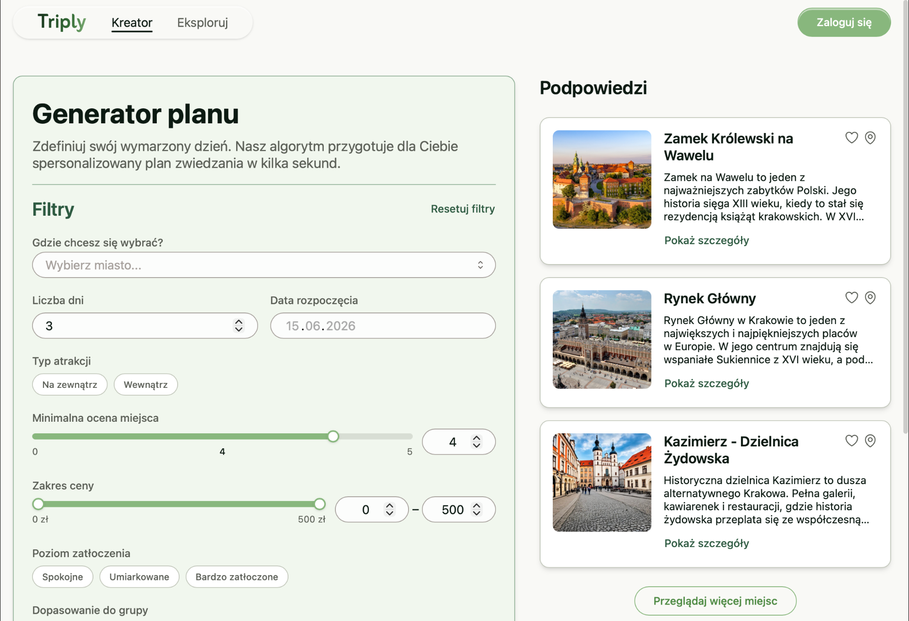
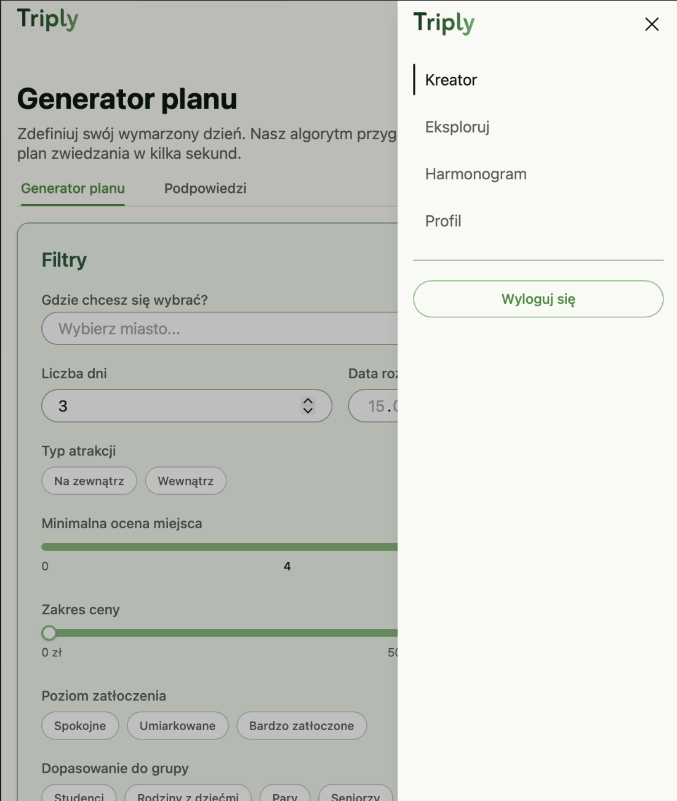

### Karta atrakcji
Na przestrzeni aplikacji wykorzystywane są komponenty kart atrakcji. Każdy taki komponent pozwala również na wyświetlanie szczegółów danej atrakcji w postaci okna dialogowego z możliwością dodania atrakcji do planu podróży lub zapisania jej na liście ulubionych.

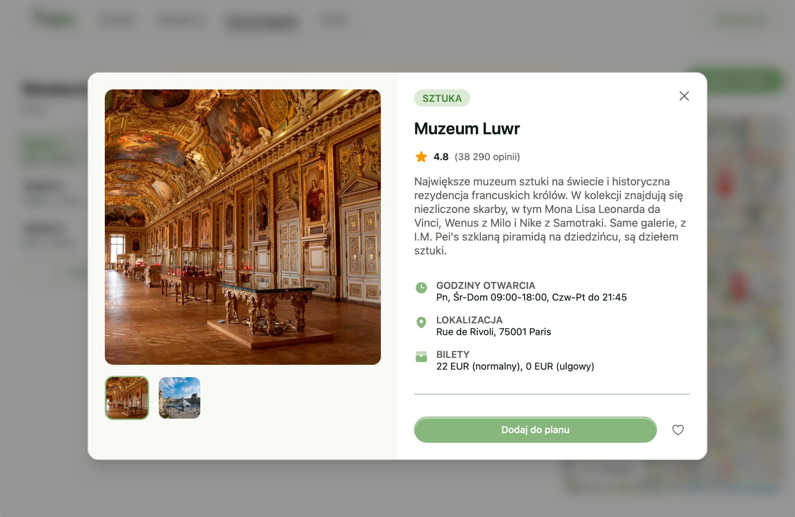

### Eksploruj - `/explore`

Strona eksploracji służy do przeglądania dostępnych miejsc i atrakcji. Zawiera search bar, filtry oraz grid wyników. Wersja desktopowa używa bocznego panelu filtrów, a wersja mobilna pokazuje filtry w wariancie dopasowanym do mniejszego ekranu.

Najważniejsze funkcjonalności:

- wyszukiwanie po nazwie i opisie,
- filtrowanie po mieście,
- filtrowanie po typie miejsca,
- filtrowanie po ocenie,
- filtrowanie po cenie,
- filtrowanie po zatłoczeniu,
- filtrowanie po grupach docelowych,
- filtrowanie po zainteresowaniach i jedzeniu,
- licznik znalezionych wyników,
- szczegóły miejsca w dialogu.

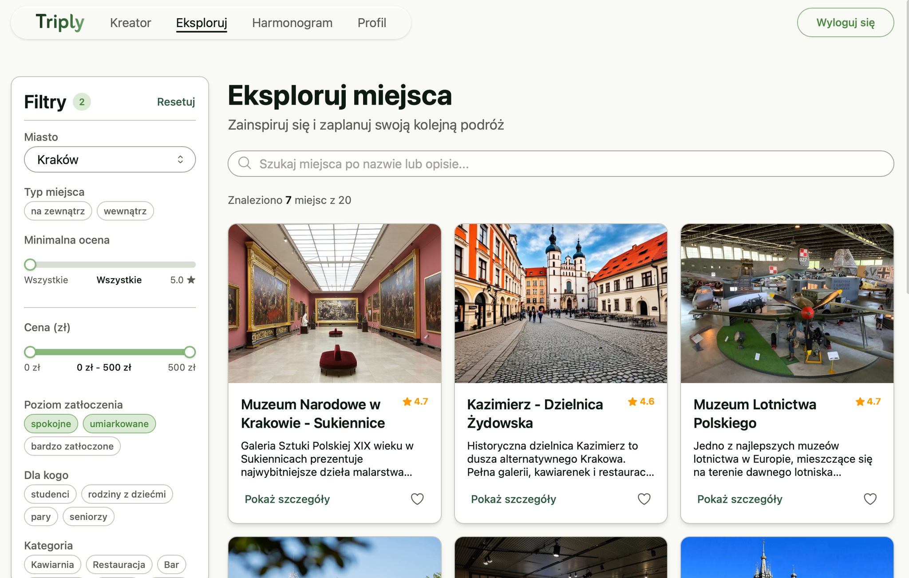
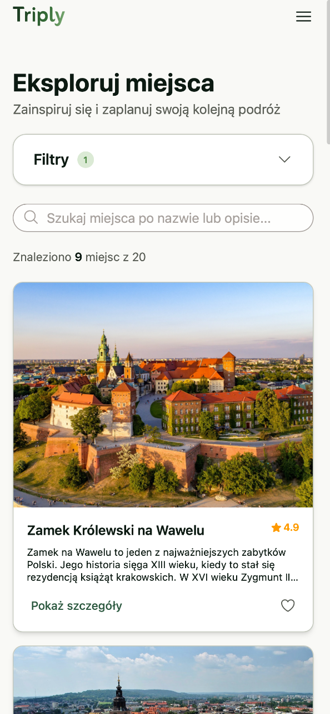

### Logowanie - `/login`

Ekran logowania umożliwia zalogowanie użytkownika przez email i hasło albo przez Google. Formularz korzysta z akcji React i obsługuje błędy Firebase w czytelnej formie dla użytkownika.

Najważniejsze funkcjonalności:

- logowanie email + hasło,
- logowanie przez Google popup,
- obsługa błędnych danych logowania,
- informacja o zbyt wielu próbach,
- przejście do rejestracji,
- przekierowanie po poprawnym zalogowaniu.

```tsx
await signInWithEmailAndPassword(auth, email, password);
navigate("/");
```

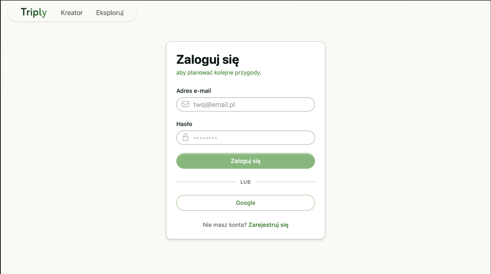

### Rejestracja - `/register`

Ekran rejestracji pozwala utworzyć konto przez email i hasło albo kontynuować przez Google. Formularz sprawdza zgodność haseł i pokazuje komunikaty błędów zwrócone przez Firebase.

Najważniejsze funkcjonalności:

- rejestracja email + hasło,
- rejestracja przez Google,
- walidacja powtórzenia hasła,
- link do regulaminu,
- link do polityki prywatności,
- przejście do logowania dla istniejących użytkowników.

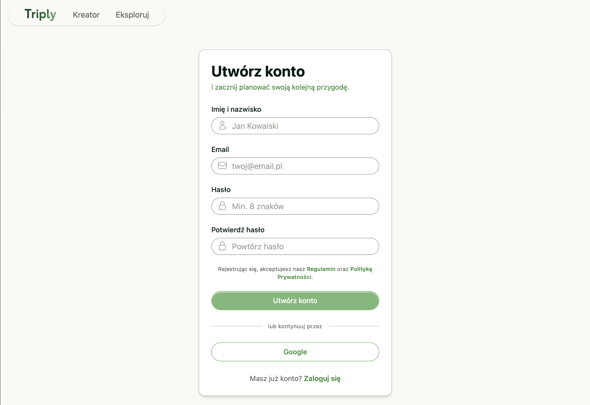

### Harmonogram - `/schedule` i `/schedule/:id`

Harmonogram jest chronioną częścią aplikacji. Ścieżka `/schedule` pokazuje placeholder z wyborem dalszej akcji, natomiast `/schedule/:id` pokazuje konkretny plan. Plan może pochodzić z aktualnie wygenerowanego stanu albo z zapisanych w profilu planów użytkownika.

Najważniejsze funkcjonalności:

- widok pustego harmonogramu z CTA do wygenerowania planu lub wyboru zapisanego planu z profilu,
- podgląd wygenerowanego planu pod `/schedule/generated`,
- podgląd zapisanego planu pod `/schedule/:id`,
- lista dni podróży,
- lista miejsc w danym dniu,
- mapa z markerami miejsc,
- dialog szczegółów miejsca,
- edycja nazwy planu,
- dodawanie dni,
- usuwanie dni,
- usuwanie miejsc,
- dodawanie miejsca do planu bezpośrednio z mapy,
- drag and drop miejsc w obrębie dnia i pomiędzy dniami,
- zapis planu lub zmian,
- responsywny układ desktop/mobile.

Generowanie planu działa przez `GeneratedPlanProvider`, który przechowuje aktualny plan w context i po wygenerowaniu przechodzi na widok harmonogramu.

```tsx
const generatePlan = useCallback(
  async (newFilters: PlanFilters) => {
    setIsGenerating(true);
    setFilters(newFilters);

    try {
      const plan = await generatePlanUtil(newFilters);
      setCurrentPlan(plan);
      setHasUnsavedChanges(true);
      navigate("/schedule/generated");
    } finally {
      setIsGenerating(false);
    }
  },
  [navigate],
);
```

Widok planu korzysta z kilku wyspecjalizowanych hooków, np. `useEditablePlan`, `usePlanDaySelection`, `usePlanMapData`, `usePlanNameEditing`, `usePlanPlaceDialog`, `usePlanDayManagement` i `usePlanDragAndDrop`. Dzięki temu jeden duży ekran jest podzielony na mniejsze, testowalne i czytelne fragmenty.

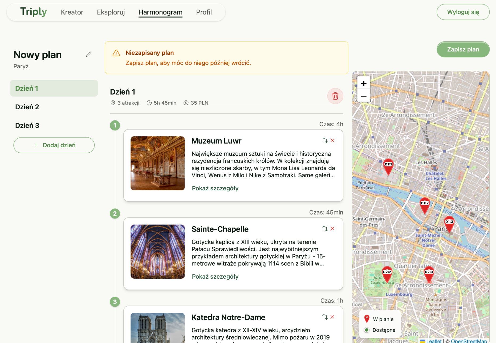

### Profil - `/profile`

Profil jest chronionym widokiem dostępnym tylko dla zalogowanych użytkowników. Strona pokazuje podstawowe dane użytkownika z Firebase oraz trzy zakładki: zapisane plany, miejsca i preferencje.

Najważniejsze funkcjonalności:

- wyświetlenie nazwy lub emaila użytkownika,
- avatar z `photoURL` albo fallback z inicjałem,
- zakładka `Plany`,
- zakładka `Miejsca`,
- zakładka `Preferencje`,
- sterowanie aktywną zakładką przez query parameter `tab`,
- usuwanie zapisanych planów z listy,
- przejście do zapisanego harmonogramu,
- usuwanie ulubionych miejsc,
- ponowne użycie zapisanych preferencji w kreatorze.

Fragment obsługi zakładek:

```tsx
const activeTab = searchParams.get("tab") ?? "plans";

const handleTabChange = (tabId: string) => {
  setSearchParams((prev) => {
    const next = new URLSearchParams(prev);
    next.set("tab", tabId);
    return next;
  });
};
```

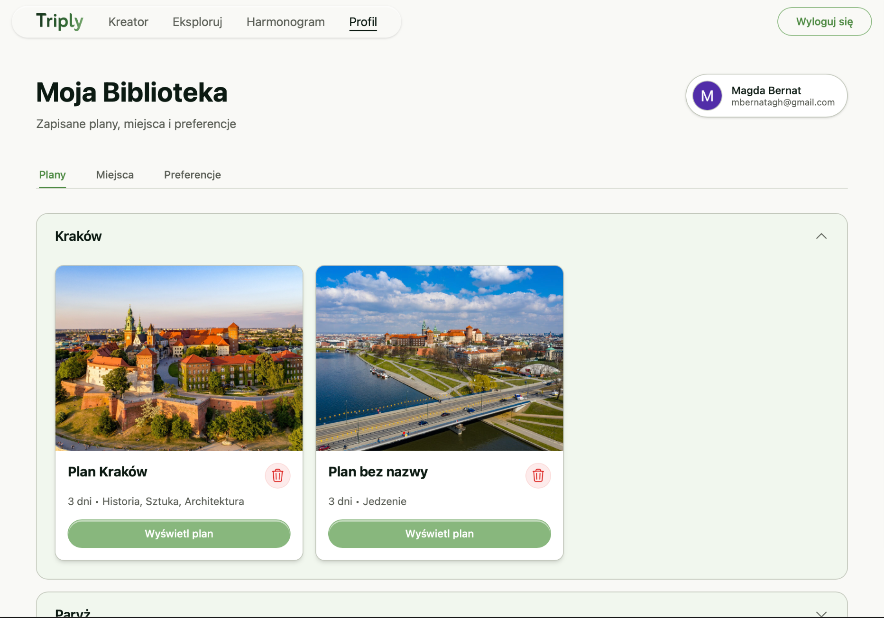
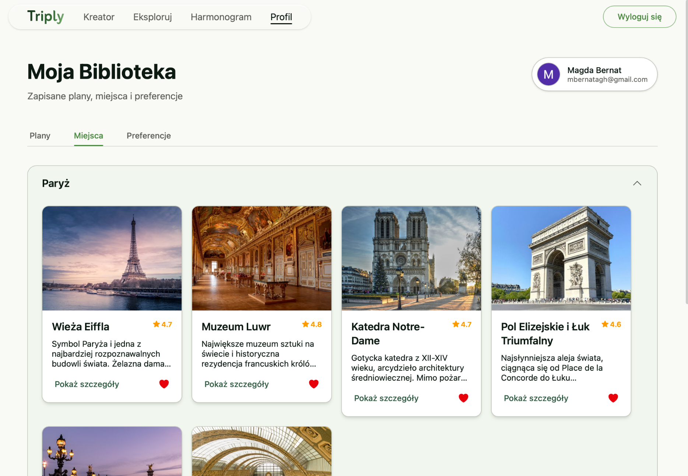
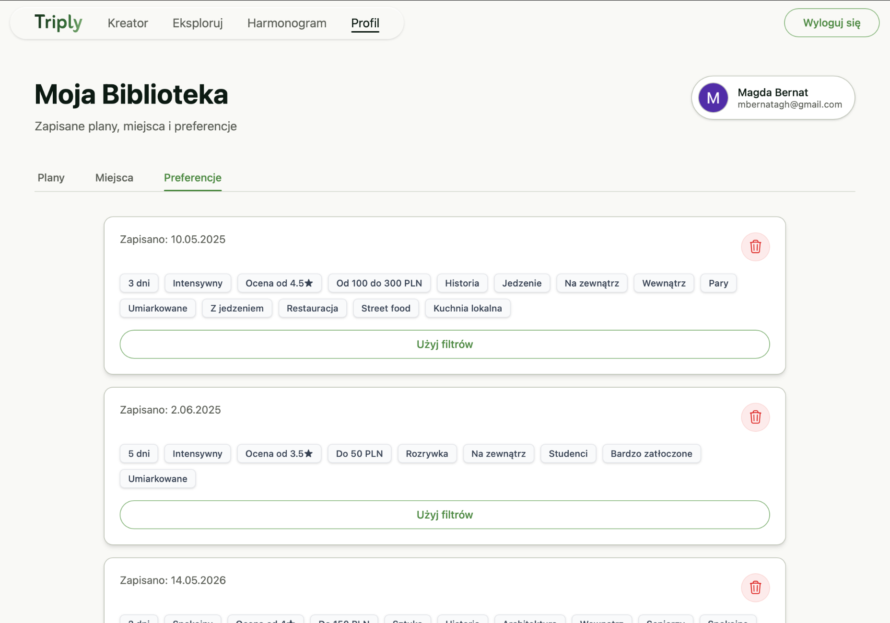

### Strony prawne - `/privacy-policy` i `/terms-and-conditions`

Aplikacja zawiera także proste strony prawne dostępne z formularza rejestracji. Są to osobne widoki w `src/pages/legal`, dzięki czemu również te ekrany są obsługiwane przez React Router.

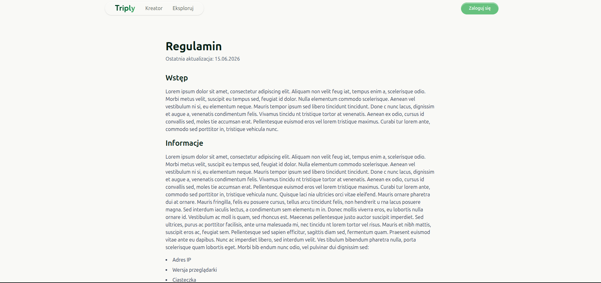

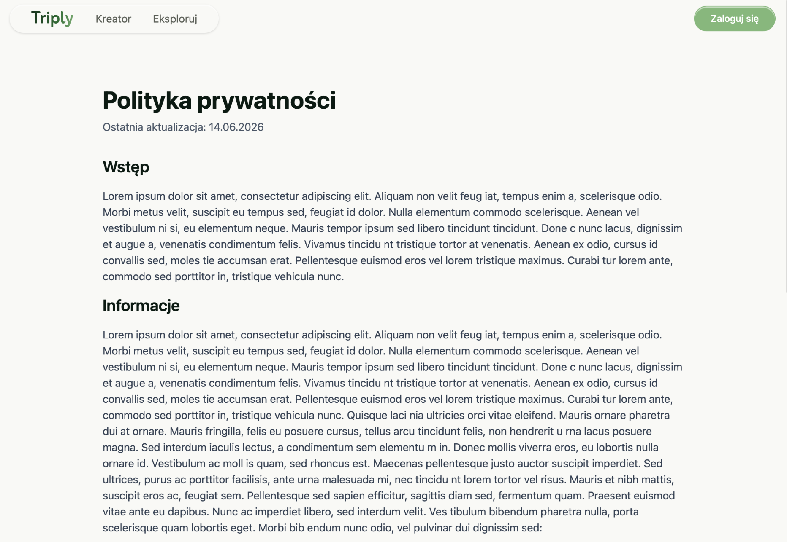

## Komponenty współdzielone i design system

Powtarzające się elementy UI zostały wydzielone do komponentów, aby utrzymać spójność wizualną i ograniczyć duplikację kodu.

Najważniejsze grupy komponentów:

- atoms: `Button`, `Link`, `Divider`, `LoadingDots`,
- forms: `Input`, `InputGroup`, `CheckboxButton`, `RadioButton`, `Slider`, `Switch`, `Combobox`,
- cards: `LightCard`, `DarkCard`, `ExpandableCard`,
- navigation: `NavbarDesktop` i `NavbarMobile`, `Tabs` i `TabItem`,
- overlays: `Dialog`, `Popup`, `Toast`,
- typografia `H1`, `H2`, `H3`, `P1`, `P2`, `P3`, `Label`,
- karty miejsc w folderze shared: `PlaceCardHorizontal`, `PlaceCardVertical`, `PlaceDetailsDialog`, `GalleryDialog`,
- `Map` oparty o Leaflet.

Przykładem komponentu wielokrotnego użytku jest `Button`, który obsługuje różne warianty stylu i może działać jako zwykły przycisk albo link routera:

```tsx
if (to) {
  return (
    <Link to={to} className={classes} ref={ref as React.Ref<HTMLAnchorElement>}>
      {children}
    </Link>
  );
}

return (
  <Headless.Button {...props} className={classes} ref={ref} disabled={disabled}>
    {children}
  </Headless.Button>
);
```

## Stylowanie i UI

Projekt jest ostylowany przy pomocy Tailwind CSS. Globalne style i tokeny kolorystyczne znajdują się w `src/globals.css`. Dzięki temu aplikacja używa spójnych nazw kolorów, np. `backgroundPrimary`, `contentPrimary`, `accentBase` i `borderSecondary`.

Fragment tokenów design systemu:

```css
@theme {
  --color-backgroundPrimary: #f9f9f6;
  --color-backgroundSecondary: #f1f7ee;
  --color-contentPrimary: #0b1a12;
  --color-contentSecondary: #5a5e56;
  --color-accentBase: #88b77e;
  --color-accentDark: #4d8b43;
  --color-borderSecondary: #c3c8bc;
}
```

Headless UI jest wykorzystywany tam, gdzie ważna jest dostępność i poprawne zachowanie komponentów bazowych, np. w dialogach, fieldsetach, buttonach i comboboxach. Tailwind odpowiada za warstwę wizualną, spacing, kolory, responsywność i layout.

Główna nawigacja i komponent ładowania korzysta z Framer Motion, dzięki czemu wszystkie animacje działają płynnie. Ikony pochodzą z Heroicons.

## Zastosowane technologie i narzędzia

- `React 19` - budowa interfejsu komponentowego.
- `Vite` - szybkie środowisko dev i build produkcyjny.
- `TypeScript` - typowanie propsów, danych i logiki aplikacji.
- `React Router` - routing SPA oraz ochrona tras.
- `Firebase Authentication` - logowanie, rejestracja i sesja użytkownika.
- `Tailwind CSS` - stylowanie i responsywność.
- `Headless UI` - dostępne komponenty bazowe.
- `Heroicons` - ikony.
- `Framer Motion` - animacje komponentów.
- `Leaflet` i `React Leaflet` - mapa w harmonogramie.
- `@dnd-kit` - drag and drop miejsc w planie.
- `pnpm` - package manager projektu.
- `ESLint` - statyczna analiza kodu.
- `Prettier` - automatyczne formatowanie.
- `Husky` i `lint-staged` - automatyczna kontrola jakości przed commitami.
- `PostCSS` i `Autoprefixer` - obsługa Tailwind CSS i kompatybilność CSS.

Skrypty z `package.json`:

```json
{
  "dev": "vite",
  "build": "tsc -b && vite build",
  "lint": "eslint .",
  "preview": "vite preview",
  "format": "prettier --write ."
}
```

## Analityka - Google Analytics i Contentsquare / Hotjar

Analityka została zintegrowana przez Google Tag Manager. Sam GTM jest dodany w `index.html`, a Google Analytics oraz Contentsquare(Hotjar) są skonfigurowane jako tagi w panelu GTM.

Dla aplikacji SPA bardzo ważna jest konfiguracja triggerów na zmianę URL, czyli History Change. React Router zmienia adres bez pełnego reloadu strony, dlatego standardowy trigger page load nie wystarcza do kompletnego śledzenia przejść między ekranami. Dzięki konfiguracji triggerów na zmianę URL każde przejście między widokami może być raportowane jako osobna odsłona lub zdarzenie. <b>Zastosowanie gtm wraz z dedykowaną SPA konfiguracją, pozwoliło na pominięcie wprowadzania dodatkowych zmian w kodzie aplikacji (np. Event Listenerów), przy jednoczesnym zachowaniu pełnej funkcjonalności.</b>

Fragment dodania GTM w `index.html` ma postać klasycznego snippetu ładowanego w `<head>` oraz fallbacku `<noscript>` w `<body>`:

```html
<!-- Google Tag Manager -->
<script>
  (function (w, d, s, l, i) {
    w[l] = w[l] || [];
    w[l].push({ "gtm.start": new Date().getTime(), event: "gtm.js" });
    var f = d.getElementsByTagName(s)[0],
      j = d.createElement(s),
      dl = l != "dataLayer" ? "&l=" + l : "";
    j.async = true;
    j.src = "https://www.googletagmanager.com/gtm.js?id=" + i + dl;
    f.parentNode.insertBefore(j, f);
  })(window, document, "script", "dataLayer", "...");
</script>
<!-- End Google Tag Manager -->
```

Konfiguracja tagów google analytics oraz contentsquare w Google Tag Manager:

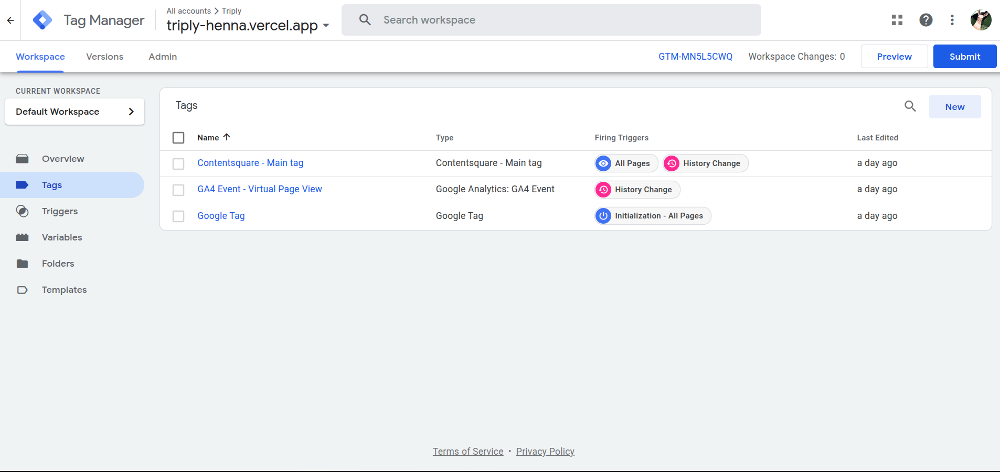

### Google Analytics

Google Analytics służy do podstawowej analizy ruchu w aplikacji. Pozwala obserwować m.in. liczbę użytkowników, aktywnych użytkowników, źródła wejścia, najczęściej odwiedzane strony, czas zaangażowania i podstawowe eventy.

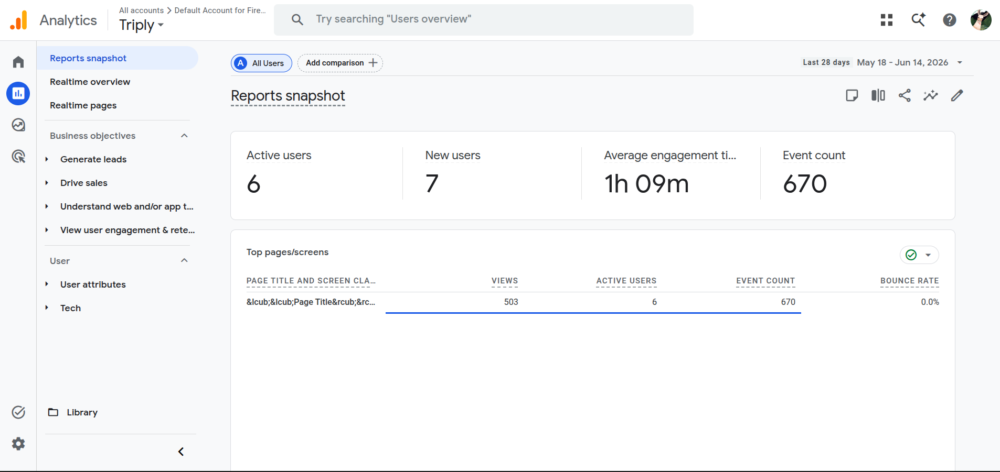
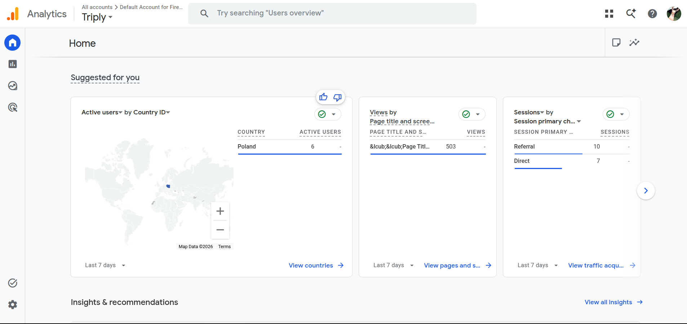


### Contentsquare (Hotjar)

Hotjar jest częścią ekosystemu Contentsquare. W projekcie pełni rolę narzędzia do jakościowej analizy zachowań użytkowników. W przeciwieństwie do samego Google Analytics, takie narzędzia pomagają zobaczyć nie tylko ile osób odwiedziło aplikację, ale też jak realnie korzystały z interfejsu.

#### Heatmapa zachowań użytkowników

Heatmapa pokazuje, które elementy strony przyciągają uwagę użytkowników. Może prezentować kliknięcia, ruch kursora scroll oraz atencję. Dzięki temu da się ocenić, czy ważne elementy, takie jak przycisk generowania planu albo filtry, są zauważane i używane.

Heatmapy są dostępne w ramach każdego widoku w aplikacji. Na potrzeby dokumentacji przedstawiono heatmapę dla widoku startowego.

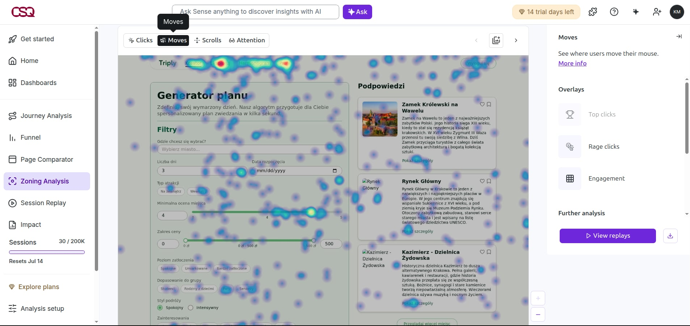

#### Replaye sesji

Session replay pozwala odtworzyć przebieg konkretnej wizyty użytkownika. Jest to przydatne przy wykrywaniu problemów UX, np. miejsc, w których użytkownik nie wie co kliknąć, wraca do poprzedniego kroku albo próbuje użyć elementu, który nie jest interaktywny.

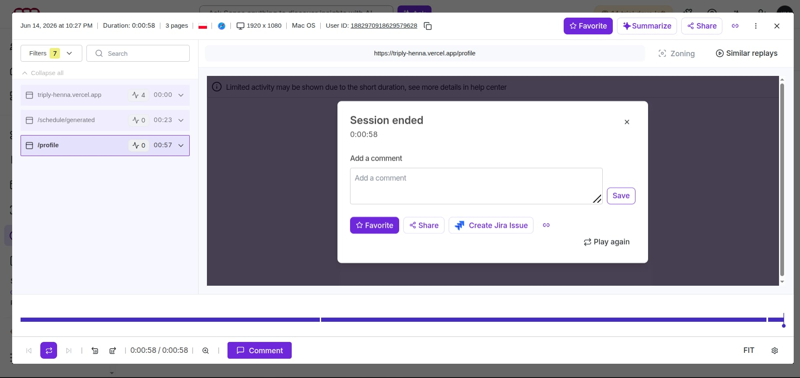

#### Zoning Analysis

Zoning Analysis służy do analizy konkretnych sekcji strony. Pozwala porównać, które obszary ekranu generują kliknięcia i zaangażowanie.

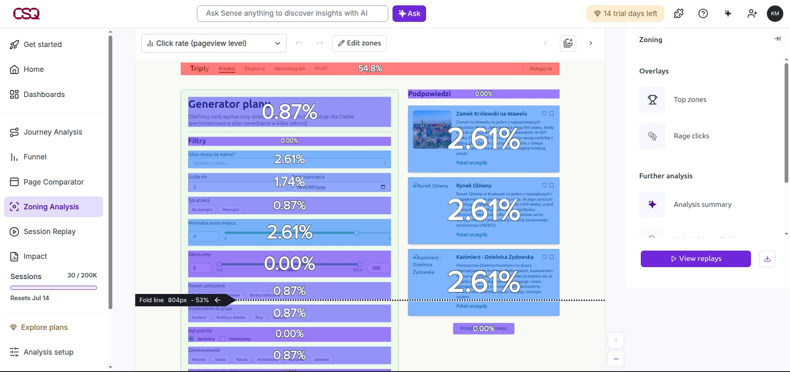

#### Page Comparator

Page Comparator pozwala porównać zachowanie użytkowników między różnymi stronami lub wariantami widoków.

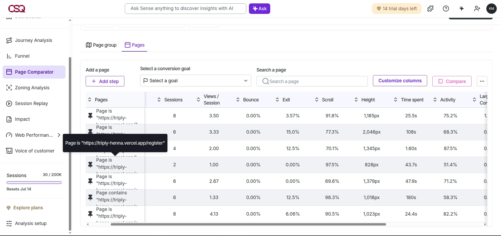

## Deployment

Aplikacja została deployowana przez Vercel:

[https://triply-henna.vercel.app/](https://triply-henna.vercel.app/)


Build produkcyjny jest wykonywany komendą:

```bash
pnpm build
```

## Uruchomienie lokalne

Instalacja zależności:

```bash
pnpm install
```

Konfiguracja środowiska:

```bash
cp .env.example .env
```

W pliku `.env` należy uzupełnić wartości Firebase zgodne ze zmiennymi używanymi przez aplikację.

Start środowiska developerskiego:

```bash
pnpm dev
```

Build produkcyjny:

```bash
pnpm build
```

Lint:

```bash
pnpm lint
```

Formatowanie:

```bash
pnpm format
```
